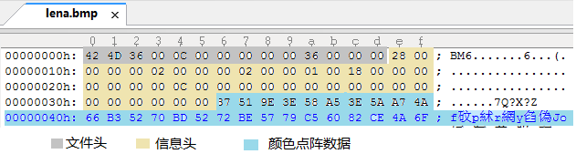
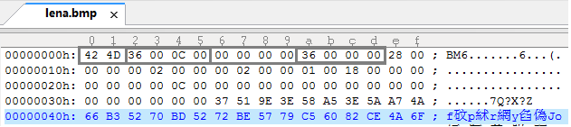
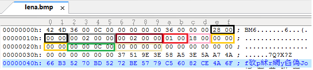

# BMP
> Created by Wei Zhou. All rights reserved.  
> My github address: <https://github.com/zromyk>

## Describe

一个BMP文件类，帮助您轻松读取和生成BMP文件。

## Build

**macOS / linux**

```
$ mkdir build && cd build   # Make a build directory in the top level directory
$ cmake .. && make          # Compile
$ cd .. && ./main           # Return to home directory and Run the program
```

**or**

```
$ ./build.sh      # Run 'build.sh', You can double click on
$ ./main          # Run the program
```
## Program structure

```
├── CMakeLists.txt
├── LICENSE
├── README.md
├── build.sh
├── image
├── image.bmp
├── include
│   ├── bmp.h
│   └── linuxTool.h
├── main
├── src
│   ├── bmp.cpp
│   ├── imageInfo.h
│   ├── linuxTool.cpp
│   └── main.cpp
└── strightRoadImage.bmp
```

## 一、什么是位图

计算机能以位图和矢量图格式显示图像。

### 1、位图(Bitmap)：

图像又称点阵图或光栅图，它使用我们称为像素(象素，Pixel)的一格一格的小点来描述图像。计算机屏幕其实就是一张包含大量像素点的网格。当我们把位图放大时，每一个像素小点看上去就像是一个个马赛克色块。

### 2、矢量图(Vector)

使用直线和曲线来描述图形，这些图形的元素是一些点、线、矩形、多边形、圆和弧线等等，它们都是通过数学公式计算获得的。

位图和矢量图最简单的区别就是：矢量图可以无限放大，而且不会失真；而位图则不能。
像Photoshop(PS)这样主要用于处理位图的软件，我们称之为图像处理软件；专门处理矢量图的软件，我们称之为图形设计软件，例如Adobe Illustrator，CorelDRAW，Flash MX等。

## 二、BMP位图文件

常见的图像文件格式有：**BMP、JPG(JPE,JPEG)、GIF**等。

BMP图像文件(Bitmap-File)格式是Windows采用的图像文件存储格式，在Windows环境下运行的所有图像处理软件都支持这种格式。Windows 3.0以后的BMP文件都是指设备无关位图(DIB，device-independent bitmap)。**BMP位图文件默认的文件扩展名是.BMP，有时它也会以.DIB或.RLE作扩展名。**

### 1. BMP文件结构

BMP文件由4部分组成：

1. 位图文件头(bitmap-file header)

2. 位图信息头(bitmap-informationheader)

3. 颜色表(color table)

4. 颜色点阵数据(bits data)

> 24位真彩色位图没有颜色表，所以只有1、2、4这三部分。



位图文件头分4部分，共14字节：

名称|占用空间|内容|实际数据
:---|:---|:---|:---
bfType|2字节|标识，就是“BM”二字|BM
bfSize|4字节|整个BMP文件的大小|0x000C0036(786486)
bfReserved1/2|4字节|保留字，没用|0
bfOffBits|4字节|偏移数，即位图文件头+位图信息头+调色板的大小|0x36(54)

> 注意，Windows的数据是倒着念的，这是PC电脑的特色。如果一段数据为50 1A 25 3C，倒着念就是3C 25 1A50，即0x3C251A50。因此，如果bfSize的数据为36 00 0C 00，实际上就成了0x000C0036，也就是0xC0036。



#### 1.2 位图信息头

位图信息头共40字节：

名称|占用空间|内容|实际数据
:---|:---|:---|:---
biSize|4字节|位图信息头的大小，为40|0x28(40)
biWidth|4字节|位图的宽度，单位是像素|0x200(512)
biHeight|4字节|位图的高度，单位是像素|0x200(512)
biPlanes|2字节|固定值1|1
biBitCount|2字节|每个像素的位数|1-黑白图，4-16色，8-256色，24-真彩色|0x18(24)
biCompression|4字节|压缩方式，BI_RGB(0)为不压缩|0
biSizeImage|4字节|位图全部像素占用的字节数，BI_RGB时可设为0|0x0C
biXPelsPerMeter|4字节|水平分辨率(像素/米)|
biYPelsPerMeter|4字节|垂直分辨率(像素/米)|
biClrUsed|4字节|位图使用的颜色数|如果为0，则颜色数为2的biBitCount次方|0
biClrImportant|4字节|重要的颜色数，0代表所有颜色都重要|0

> 作为真彩色位图，我们主要关心的是biWidth和biHeight这两个数值，两个数值告诉我们图像的尺寸。biSize，biPlanes，biBitCount这几个数值是固定的。想偷懒的话，其它的数值可以一律用0来填充。



#### 1.3 颜色表

24位真彩色位图没有颜色表。为了简化，只讨论24位真彩色位图。

#### 1.4 颜色点阵数据

位图全部的像素，是按照自下向上，自左向右的顺序排列的。

RGB数据也是倒着念的，原始数据是按B、G、R的顺序排列的。
